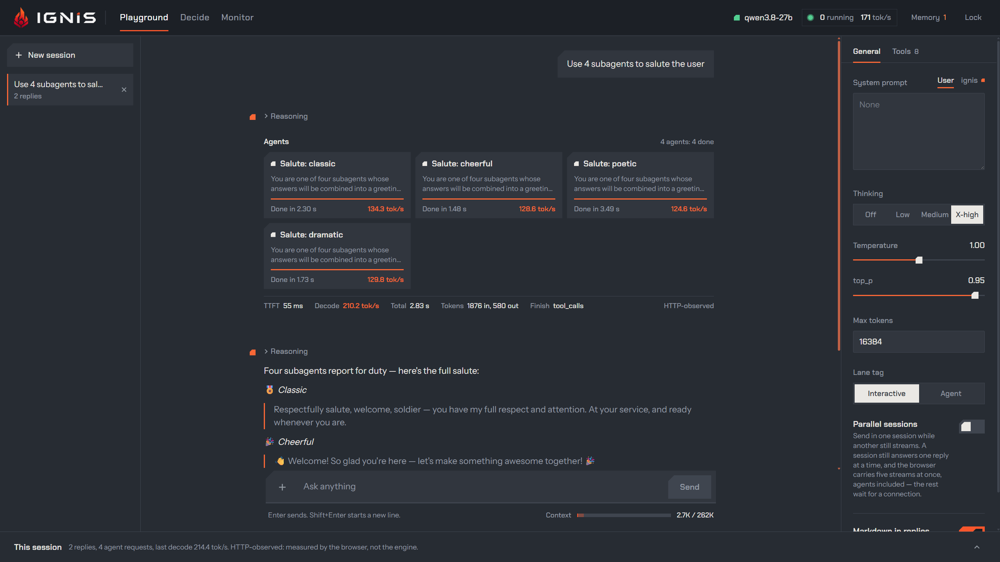
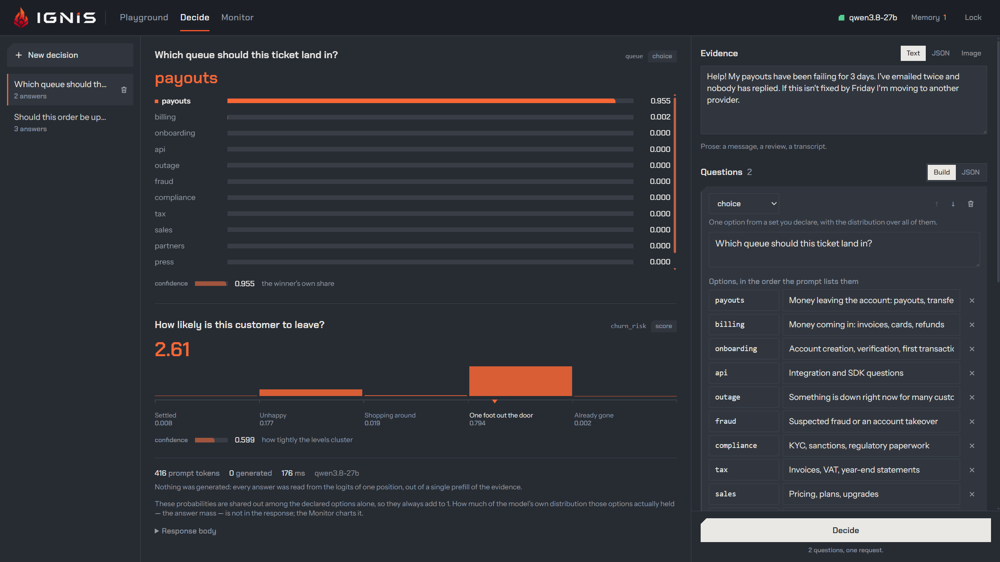
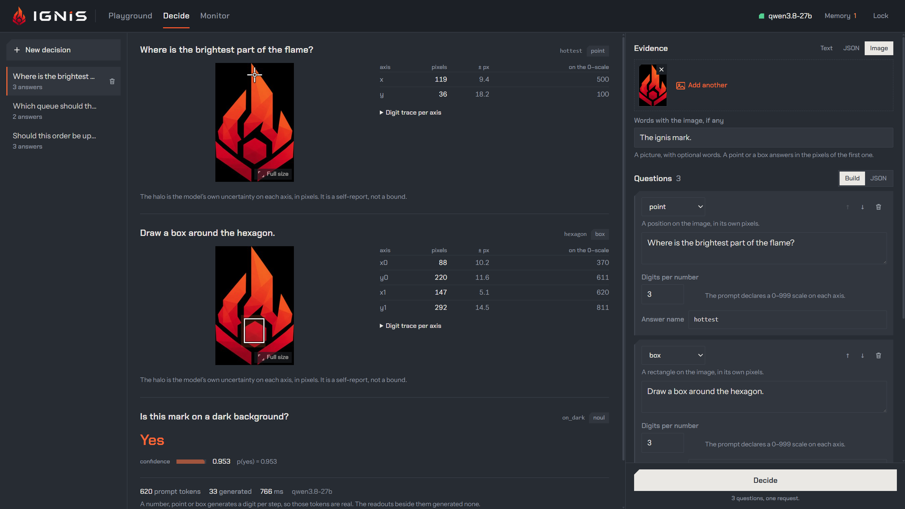
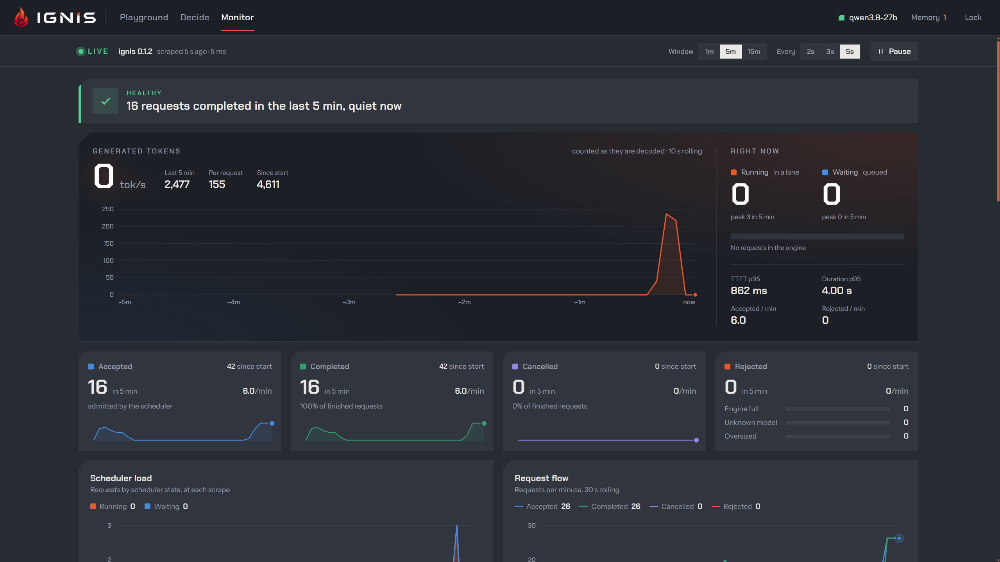
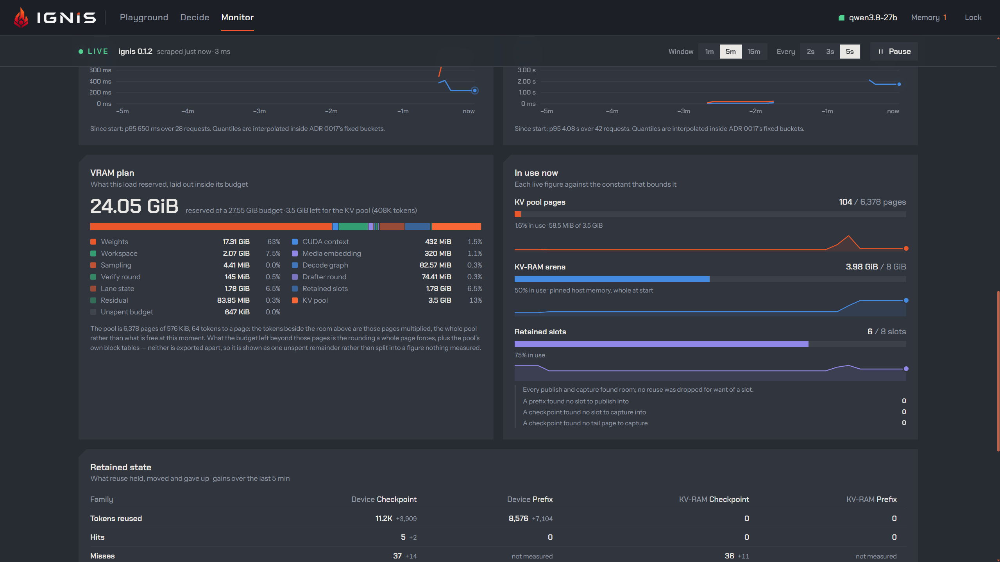

<p align="center">
  
</p>

<h1 align="center">Ignis</h1>

<p align="center">
  <b>A single-GPU inference engine for Qwen3.8-27B, built for the load an agent makes.</b>
</p>

<p align="center">
  OpenAI-compatible HTTP API &nbsp;·&nbsp; Rust core &nbsp;·&nbsp; C++/CUDA kernel leaf &nbsp;·&nbsp; one Blackwell card
</p>

<p align="center">
  
  
  
  
</p>

---

Ignis is a deliberately specialized engine: **one model family, one class of
card**. It gives up generality and takes back speed. It loads an NVFP4
Qwen3.8-27B onto a single Blackwell card — an **RTX 5090** or an **RTX PRO
6000**, both `SM120a` — serves streaming and non-streaming
completions over the OpenAI v1 API, and is shaped around the workload a
developer actually produces — *one main agent plus a handful of subagents
hitting the same card at once*. Eight resident decode lanes run as one
batch-wide round; the paged KV cache is budgeted in bytes rather than in
sequences; conversation state survives the request that built it; images are
evidence, not an afterthought; and a decision can be answered without
generating a single token. A Playground, a live Monitor and Prometheus
metrics ship in the binary.

Rust owns everything above the *step* — scheduling, admission, KV accounting,
serving. The forward pass and all GPU compute live in a C++/CUDA static
library behind a flat, device-resident step-level C ABI. The engine is its own
dogfood target, and partly there already: it serves some of the coding agents
that build it, and the rest of that is what the remaining work is for.

## TL;DR

Take a build from **[Releases](https://github.com/gpillon/ignis/releases)** — a
Windows `.zip`, a Linux `.tar.gz`, or the `linux/amd64` container image on
`ghcr.io/gpillon/ignis`. Run it on a Blackwell card:

```
ignis-server                       # no model yet? it offers to fetch one
```

Then the OpenAI API is on <http://127.0.0.1:8000/v1> and the Playground on
<http://127.0.0.1:8000/ui/>. Everything else — the container, building from a
checkout, every flag — is [Quick start](#quick-start) and
[docs/user](docs/user/README.md).

## What sets it apart

Every number below is a measurement on a 5090.

### The decode round

- **One batch-wide round for all eight lanes**, replayed from **per-width CUDA
  graphs** (widths 1..8), not one launch sequence per sequence.
- The round is **1,166 graph nodes and 15.81 ms of device time that is weight
  streaming at the card's bandwidth** — the backbone GEMM at 100% of roofline,
  the output head at 86%. Graph submission costs 2.2% of it, and the whole
  remaining headroom is the 4.8% the device spends idle.
- Prefill and decode **interleave at chunk level**, so a long prompt never
  stalls the lanes already generating.

### Speculative decoding (DFlash2)

- The served artifact carries a **grafted DFlash2 drafter**; `--spec dflash2
  --draft-tokens 7` runs draft-and-verify rounds against it.
- The drafter's vendored top-k gave one warp to each of seven columns over a
  248k vocabulary and spent 3,145 µs — 16.4% of decode kernel time — to move
  2.0 µs of memory. **Our row-split replacement does it in 44 µs at a
  bit-identical answer: 17.6% of a decode round, +21% decode throughput at one
  lane**. A vendored kernel *measured* as the bottleneck may be replaced — that
  is the one exemption to verbatim vendoring.

### KV that costs bytes, not sequences

- **hq-e8-2b** is the serving KV format: a sequence-token costs **9,216 bytes
  against BF16's 65,536 — 7.11x the capacity**, so eight lanes at a 40,960
  context need ~3.02 GB instead of 20 GiB.
- BF16 is retained, not deprecated: it is the format every correctness oracle
  runs against.
- The GQA workspace zeroing is **dead work under hq** — every byte the next
  launch reads it writes itself — and removing it is worth 2.12% of GQA layer
  device time on a 70K prefill.

### State that outlives its request

- **Cross-request reuse**: a prompt checkpoint captured at the generation
  opener, a retained prefix shared between siblings, and a lazy spill into a
  pinned **KV-RAM** host tier with unified eviction.
- A device-to-device prefix clone is **0.25 ms for 148 MiB — 96x cheaper than a
  PCIe round trip and ~8,000x cheaper than re-prefilling the head**; a
  full-context snapshot/restore round trip is ~90 ms, about 100x cheaper than
  the re-prefill it replaces.

### A VRAM plan, decided at load

- Every byte the process will hold is **reserved and laid out before the first
  request**, and the plan is printed: weights, workspaces, lane state, decode
  and drafter graphs, retained slots, media embeddings, and whatever is left
  becomes the KV pool. The Monitor shows that plan beside what is in use —
  [see it](#the-playground).
- The load that used to grow the process **2,734 MiB in 14 minutes now grows it
  6 MiB in 24.5**, and the printed plan matches what the OS reports to within
  16 MiB. No paging, no surprise at minute forty.

### Lanes that know who is asking

- A request states its own **lane tag** — `interactive` or `agent` — through the
  `class` extension field or an `@<lane>` suffix on the model name. The tag
  drives protection, backfill priority and eviction order, so a burst of
  subagents fills the lanes a foreground conversation is not using instead of
  evicting it.
- Admission is a full state machine: protection, backfill class, temporal
  credit, frontier distance.

### Jev-like decisions, answered without generating (`/v1/decide`)

- A **classification is not a completion**. `POST /v1/decide` prefills the
  evidence once and reads the answer out of the logits at a single position.
- Six primitives: **`noul`** (yes/no), **`choice`**, **`score`**, and — one
  constrained digit per step — **`number`**, **`point`**, **`box`**.
- On 144 authored decisions the declared options hold a median **99.8%** of the
  model's distribution, and the readout costs **~36.5 ms and zero decoded
  tokens** at 0.934 balanced accuracy on the layout first measured; moving the
  evidence into the system block takes it to **0.963**.
- `point` reads a click target off a 4096px screenshot to within 84 px worst
  case, inside the button on every scene tested.
- The same handler is served as **`/v1/systemone`**, so a Jev client reaches
  this engine by changing the URL and nothing else.

### Images as evidence

- `--vision` loads the tower and reserves its workspace; images arrive inline
  as data URIs or as URLs the server fetches, prepares and caches.
- The encoder output is kept past its request, keyed by content digest and
  grid: **four questions over one 4096x4096 screenshot go from 27.92 s to
  13.24 s** on one encode instead of four, and 9.49 s when the picture was
  already seen.
- The tower's quadratic curve is the checkpoint's own scheme, not a bug: 88.2%
  of a 16,384-column encode is the attention kernel, holding 164.7 TFLOP/s with
  0.1% device idle, so 3.67 s is the worst case per image — and the only lever
  is sending a smaller one.

### A context you can rescale

- The checkpoint is trained to **262,144 positions**; `--rope-scaling yarn:F`
  rescales that envelope, `yarn:4` putting the ceiling at **1,048,576**
  (factor up to 64). What a long-context probe must ask is a question about
  *relative* position — a literal needle at 320K is recalled with the flag and
  without it.

### Batteries in the binary

- **The Playground** at `/ui/` — chat with tools and subagents, parallel
  sessions, image input, a Decide tab and a live Monitor. Built into the
  server, not a separate service.
- **Prometheus** on its own listener (`--metrics`), with the VRAM plan, retained
  state, KV pool occupancy, decision counters and request lifecycle.
- **It fetches its own model.** Started with no artifact, a GPU build asks, then
  downloads and verifies it.
- **`--api-key` and `--expose`** — a keyed public URL through a quick Cloudflare
  tunnel, key always required.
- **Linux and Windows**, a `linux/amd64` container image on `ghcr.io`, and
  release archives cut from the same build.

## The Playground

Agents running in parallel, each on its own lane, with the engine's own timings
beside every reply:



A decision over prose — the winner, the whole distribution, and a score read as
levels — answered out of one prefill with nothing generated:



The same endpoint over an image: a point, a box, and a yes/no, each a digit at a
time, with the model's self-reported uncertainty on every axis:



The Monitor scrapes the engine's own metrics: throughput, lane occupancy,
latency quantiles:



...and what the load actually reserved, against the constants that bound it:



## Quick start

### Container

```
podman run --rm --device nvidia.com/gpu=all -p 8000:8000 \
  -v /path/to/models:/models \
  ghcr.io/gpillon/ignis:0.1.2 --model-download-path /models
```

(`docker`: `--gpus all` in place of `--device`.) With no model in that
directory the server fetches one and verifies it. The Playground is then at
<http://127.0.0.1:8000/ui/>.

### From a checkout

```
make doctor          # toolchain, rust target, artifact, web deps
make dev             # build web + kernel + GPU server, then run it
make dev VISION=1    # the same, with the vision tower loaded for image input
make dev UNCENSORED=1  # the same, on the uncensored (abliterated) weights
make mock            # the same with no GPU, no kernel, no artifact
```

`make` alone lists every target; `make config` prints the exact server command a
run will use.

### A request

```bash
curl http://127.0.0.1:8000/v1/chat/completions \
  -H 'Content-Type: application/json' \
  -d '{"model":"qwen3.8-27b","messages":[{"role":"user","content":"Hello"}],"max_tokens":256}'
```

Full flag table, API surface, model handling, container and release detail:
**[docs/user](docs/user/README.md)**.

## Building it

Two parts, in this order: the C++/CUDA kernel leaf, then the Rust workspace that
links it.

- **Toolchain** — Rust; MSVC C++ build tools (Windows) or GCC (Linux); the CUDA
  Toolkit (`nvcc`, target `SM120a`); CMake + Ninja; Node.js for the Playground.
- **Kernel leaf** — `kernel/build.ps1` on Windows, `kernel/build.sh` on Linux.
  Both configure and build into `kernel/build/`, which `crates/*/build.rs` link.
- **Workspace** — `cargo build --release -p ignis-server --features cuda` for
  the real engine; without `--features cuda` (or without an artifact) the server
  runs a deterministic CPU-only mock, which is how protocol and scheduler work
  gets done with no card.

### The repo

| Path | What lives there |
|---|---|
| `crates/core/` | Scheduler, admission, paged KV accounting, request state, host tier. |
| `crates/artifact/` | The `.ninfer` reader: reader, binder, materializer. |
| `crates/runtime/` | Safe wrapper over the step ABI (`CudaLeaf`, decode graphs). |
| `crates/server/` | HTTP, OpenAI schemas, decisions, metrics, telemetry. |
| `crates/logging/` | Structured logging: tracing layers, hotpath lint, trace context. |
| `crates/bench/` | Trace-replay harness, gate and canary runner. |
| `crates/vendor/` | The vendoring tool: manifest, hashes, patch records. |
| `kernel/` | The C++/CUDA leaf: the program and the vendored ops (CMake + nvcc). |
| `web/` | The Playground: React + Vite, embedded into the server at build time. |

`make` wraps all of it. Tests: `cargo test` is workspace-wide, CPU-only and
never touches the GPU; GPU work is checked by a separate explicit profile that
**fails** rather than skips when the card is busy. The 5090 fits one run at a
time — check `make gpu-status` before starting anything on it.

## Documentation

| | |
|---|---|
| [`docs/user/`](docs/user/README.md) | Running it: flags, API, models, container, releases, telemetry. |
| [`docs/adr/`](docs/adr/) | Every architectural decision, and why it was taken. |
| [`docs/findings/`](docs/findings/README.md) | Durable, evidence-backed measurements. |
| [`docs/agents/`](docs/agents/) | Conventions for agents working in this repo. |
| [`CONTEXT.md`](CONTEXT.md) | The glossary. One vocabulary, one meaning per term. |

An OpenAPI description of the HTTP surface is planned and will supersede the
API section of the user docs.

## Lineage

Ignis descends from [**NInfer**](https://github.com/Neroued/ninfer), a lineage
of Windows-oriented local-inference forks, and does not hide it. The pinned
reference is the fork [`gpillon/ninfer`](https://github.com/gpillon/ninfer),
itself downstream of [`cometkim/ninfer`](https://github.com/cometkim/ninfer)
(kernel-perf, hyperquant KV, NVFP4-full, the original DFlash2 port) →
[`natpate/ninfer-windows`](https://github.com/natpate/ninfer-windows) (the
Windows port) → [`Neroued/ninfer`](https://github.com/Neroued/ninfer) (the
original engine). The `.ninfer` model artifact is NInfer's format,
and the kernel leaf **vendors NInfer's CUDA ops verbatim** under a manifest that
pins the reference commit and every file's content hash — a port claim you can
diff. What is ours is the layer above them: the forward pass, the sequence
state, the step ABI, the scheduler, and by now the kernels that measurement
asked us to rewrite.

Ignis is **not** a port of NInfer. It is a different architecture that starts
from proven kernel work.

## Credits

With thanks to the NInfer project and its contributors:

- **cometkim** — kernel-perf integration (PDL decode chain, split-K prefill,
  per-request error boundary), the DFlash2 base port, the hyperquant KV cache,
  the 1M-context envelope, the NVFP4-full target.
- **Mirko Covizzi** — RTX 5090 Laptop compatibility, MTP adaptive
  verification-width tuning.
- **mr-september** — warmup/readiness decoupling, frontend streaming fixes.
- **dylan (dylanbrodiefafard)** — the RAM KV cache concept, LRU lane eviction,
  the decode CPU-spin fix.
- **Neroued** — the original NInfer engine.

## License

Apache License 2.0.
